  

  
  
  
  
  

  

 

<picture>
  <source media="(prefers-color-scheme: dark)" srcset="assets/title-sobre-mi-en-dark.svg">
  
</picture>

Computer Engineer from **Universidad Autónoma de Occidente** (Cali, Colombia), finishing a **specialization in Cybersecurity**.

I build systems and automations for businesses: I learn how the business works, find what is still done by hand and automate it with **web development, n8n and AI**, shipped **tested and secure**.

| | |
|---|---|
| **60–100** | orders per day in a restaurant’s real-time order system |
| **3,500+** | SonarQube issues fixed leading quality on MediSync (80.2% coverage) |
| **Ley 1581** | encrypted sensitive data, two-factor auth and access auditing (Colombian data-protection law) |

 

<picture>
  <source media="(prefers-color-scheme: dark)" srcset="assets/title-proyectos-en-dark.svg">
  
</picture>

<table>
  <tr>
    <td width="50%" valign="top">
      
      <h3>Ricuras Fegaf</h3>
      
Real-time order system for a restaurant in Cali: tables, kitchen, deliveries and daily cash closing. In daily use since June 2026.

      
<b>Next.js · Supabase · PostgreSQL</b>

      
<a href="https://willirv1.github.io/proyectos/ricuras-fegaf.html">Case study &rarr;</a> (private client code)

    </td>
    <td width="50%" valign="top">
      
      <h3>Kovat</h3>
      
SaaS for functional-training gyms: automatic billing, overdue tracking, class booking, daily WOD and alerts for athletes about to churn. In validation with gyms in Cali.

      
<b>React · Vite · Supabase · Edge Functions</b>

      
<a href="https://willirv1.github.io/proyectos/kovat.html">Case study &rarr;</a> · <a href="https://kovat.com.co">kovat.com.co</a>

    </td>
  </tr>
  <tr>
    <td width="50%" valign="top">
      
      <h3>PsicoSST</h3>
      
Platform that scores Colombia’s mandatory psychosocial-risk assessment, with encryption, 2FA, access audit and digitally signed reports. In validation with occupational psychologists.

      
<b>Next.js · PostgreSQL · Prisma · Docker · Cypress</b>

      
<a href="https://willirv1.github.io/proyectos/psicosst.html">Case study &rarr;</a> (private code)

    </td>
    <td width="50%" valign="top">
      
      <h3>Dare League</h3>
      
Registration and payments for a 1v1 CrossFit tournament: tiered pricing, real-time spots and an approval dashboard.

      
<b>React · TypeScript · Supabase · Vercel</b>

      
<a href="https://willirv1.github.io/proyectos/dare-league.html">Case study &rarr;</a> · <a href="https://github.com/WilliRV1/dare-league">Code</a>

    </td>
  </tr>
  <tr>
    <td colspan="2" valign="top">
      <table><tr>
        <td width="50%"></td>
        <td width="50%" valign="top">
          <h3>C&amp;P Smile</h3>
          
Websites for a dental clinic in Cali, its academy and its lab, with a full English version for dental tourism.

          
<b>React · Vite · Tailwind</b>

          
<a href="https://willirv1.github.io/proyectos/cp-smile.html">Case study &rarr;</a> · <a href="https://github.com/WilliRV1/cp-smile-academy">Code</a>

        </td>
      </tr></table>
    </td>
  </tr>
</table>

**University team projects:** [DoURemember – E2E testing](https://github.com/WilliRV1/douremember-gamificacion-testing) · [SIGEP 2 – Spring Boot](https://github.com/WilliRV1/sigepII) · [MySQL + ProxySQL – high availability](https://github.com/WilliRV1/proyecto-mysql-proxysql) · [Flask microservices](https://github.com/WilliRV1/microWebAppParcial)

 

<picture>
  <source media="(prefers-color-scheme: dark)" srcset="assets/title-tecnologias-en-dark.svg">
  
</picture>

**Automation & AI**

  &nbsp;
  
  
  
  
  

**Development**

**Data & infrastructure**

**Quality & security**

  &nbsp;
  
  
  
  

 

  

