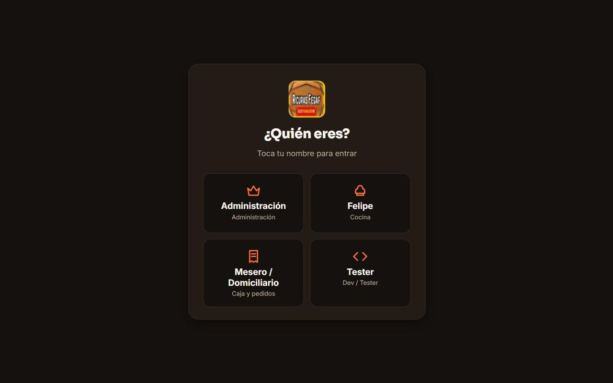
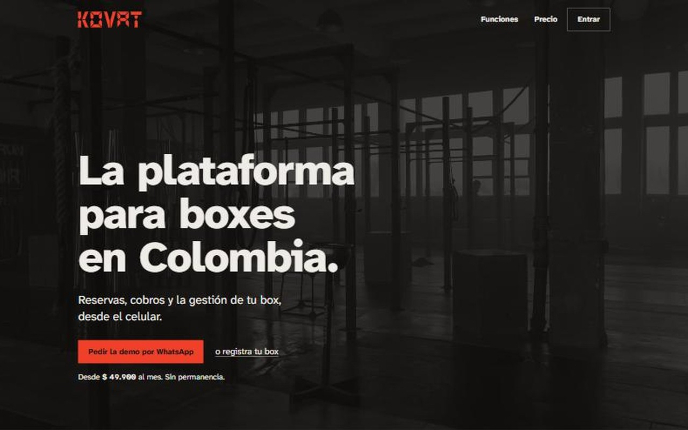
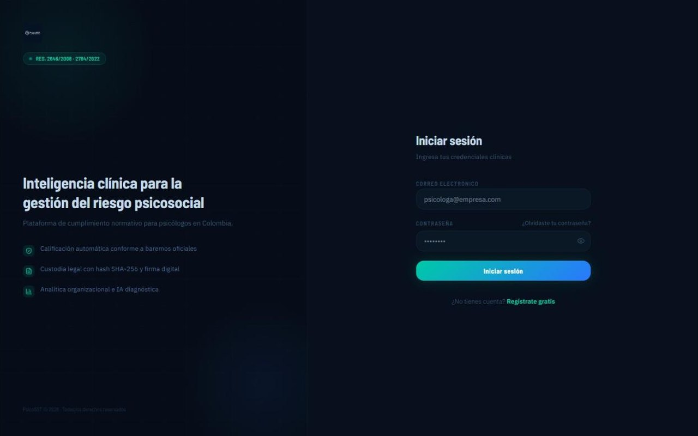
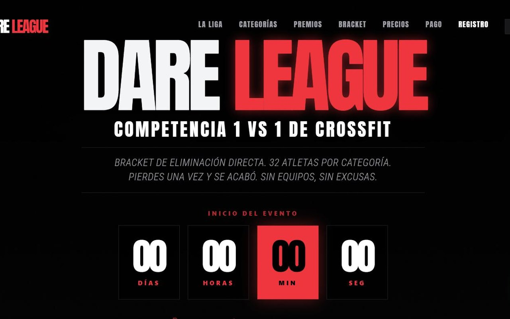
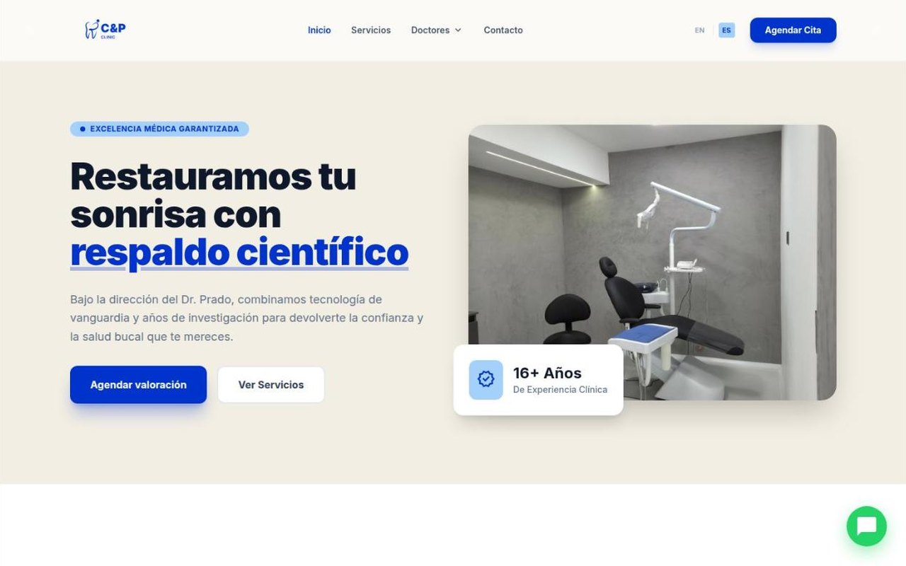

  

  
  
  
  
  

 

Computer Engineer from Cali, Colombia, finishing a specialization in Cybersecurity. I build web systems and process automations with Next.js, Supabase, n8n and AI, and I test them with Cypress and Playwright. One of them is a real-time order system a restaurant uses every day (60–100 orders/day). Open to remote roles in automation, QA and application support.

 

<picture>
  <source media="(prefers-color-scheme: dark)" srcset="assets/title-sobre-mi-dark.svg">
  
</picture>

Ingeniero Informático de la **Universidad Autónoma de Occidente** (Cali), cursando la **especialización en Ciberseguridad**.

Construyo sistemas y automatizaciones para negocios: entiendo cómo trabaja el negocio, veo qué se está haciendo a mano y lo automatizo con **desarrollo web, n8n e IA**, dejándolo **probado y seguro**.

| | |
|---|---|
| **60–100** | órdenes diarias en el sistema de comandas de un restaurante |
| **+3.500** | issues resueltos en SonarQube liderando la calidad de MediSync (80,2 % de cobertura) |
| **Ley 1581** | cifrado de datos sensibles, doble factor y auditoría de accesos en mis proyectos |

 

<picture>
  <source media="(prefers-color-scheme: dark)" srcset="assets/title-proyectos-dark.svg">
  
</picture>

<table>
  <tr>
    <td width="50%" valign="top">
      
      <h3>Ricuras Fegaf</h3>
      
Sistema de comandas en tiempo real para un restaurante de Cali: mesa, cocina, domicilios y cierre de caja. En uso diario desde junio de 2026.

      
<b>Next.js · Supabase · PostgreSQL</b>

      
<a href="https://willirv1.github.io/proyectos/ricuras-fegaf.html">Ver caso de estudio &rarr;</a> (código privado del cliente)

    </td>
    <td width="50%" valign="top">
      
      <h3>Kovat</h3>
      
Plataforma para boxes de entrenamiento funcional: cobros automáticos, cartera por mora, reservas, WOD y aviso de atletas que dejan de venir. En validación con boxes de Cali.

      
<b>React · Vite · Supabase · Edge Functions</b>

      
<a href="https://willirv1.github.io/proyectos/kovat.html">Ver caso de estudio &rarr;</a> · <a href="https://kovat.com.co">kovat.com.co</a>

    </td>
  </tr>
  <tr>
    <td width="50%" valign="top">
      
      <h3>PsicoSST</h3>
      
Plataforma para la batería de riesgo psicosocial con cifrado, doble factor, auditoría de accesos y firma digital. En validación con psicólogos SST.

      
<b>Next.js · PostgreSQL · Prisma · Docker · Cypress</b>

      
<a href="https://willirv1.github.io/proyectos/psicosst.html">Ver caso de estudio &rarr;</a> (código privado)

    </td>
    <td width="50%" valign="top">
      
      <h3>Dare League</h3>
      
Inscripciones y pagos para un torneo de CrossFit 1v1: precios por etapa, cupos en tiempo real y panel de aprobación.

      
<b>React · TypeScript · Supabase · Vercel</b>

      
<a href="https://willirv1.github.io/proyectos/dare-league.html">Ver caso de estudio &rarr;</a> · <a href="https://github.com/WilliRV1/dare-league">Código</a>

    </td>
  </tr>
  <tr>
    <td colspan="2" valign="top">
      <table><tr>
        <td width="50%"></td>
        <td width="50%" valign="top">
          <h3>C&amp;P Smile</h3>
          
Sitios de una clínica odontológica de Cali, su academia y su laboratorio, con versión en inglés para turismo dental.

          
<b>React · Vite · Tailwind</b>

          
<a href="https://willirv1.github.io/proyectos/cp-smile.html">Ver caso de estudio &rarr;</a> · <a href="https://github.com/WilliRV1/cp-smile-academy">Código</a>

        </td>
      </tr></table>
    </td>
  </tr>
</table>

**Proyectos de equipo (UAO):** [DoURemember – pruebas E2E](https://github.com/WilliRV1/douremember-gamificacion-testing) · [SIGEP 2 – Spring Boot](https://github.com/WilliRV1/sigepII) · [MySQL + ProxySQL – alta disponibilidad](https://github.com/WilliRV1/proyecto-mysql-proxysql) · [Microservicios en Flask](https://github.com/WilliRV1/microWebAppParcial)

 

<picture>
  <source media="(prefers-color-scheme: dark)" srcset="assets/title-tecnologias-dark.svg">
  
</picture>

**Automatización e IA**

  &nbsp;
  
  
  
  
  

**Desarrollo**

**Datos e infraestructura**

**Calidad y seguridad**

  &nbsp;
  
  
  
  

 

  

